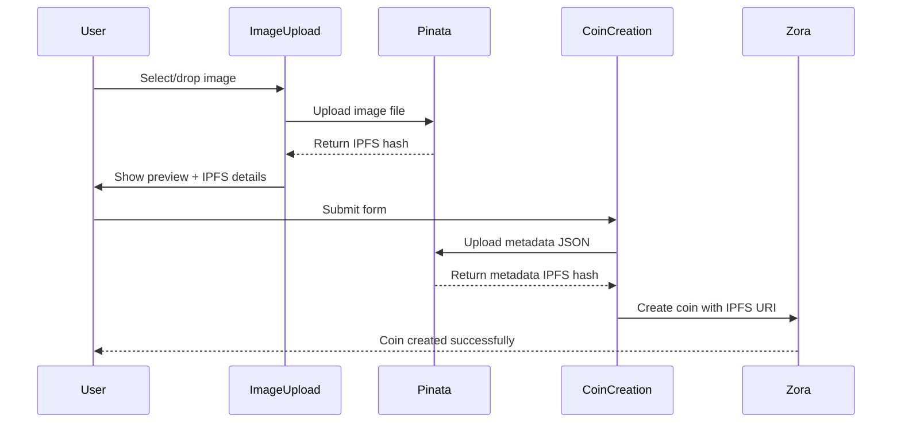

# IPFS Integration with Pinata

This document explains how the Creator Coin platform integrates with IPFS via Pinata for decentralized metadata and image storage.

## 🌟 Overview

The platform now supports full IPFS integration for:
- **Image Upload**: Creator coin images stored on IPFS
- **Metadata Storage**: JSON metadata with all coin information
- **Real Zora Integration**: Actual IPFS URIs used in coin creation
- **Image Preview**: Real-time preview during upload process

## 🔧 Setup Instructions

### 1. Install Dependencies

The required Pinata SDK is added to `package.json`:
```bash
npm install pinata
```


### 2. Get Pinata API Credentials

1. Visit [Pinata Cloud](https://app.pinata.cloud/)
2. Create an account or sign in
3. Go to **API Keys** section
4. Create a new API key with the following permissions:
   - `pinFileToIPFS`
   - `pinJSONToIPFS`
   - `unpin` (optional, for cleanup)

### 3. Environment Configuration

Copy your Pinata JWT to your `.env.local` file:
```bash
# Required for IPFS uploads  
# Updated for new Pinata SDK (pinata package)
NEXT_PUBLIC_PINATA_JWT=your_pinata_jwt_here
PINATA_JWT=your_pinata_jwt_here

# Optional: Custom gateway
NEXT_PUBLIC_PINATA_GATEWAY=gateway.pinata.cloud
```

## 📁 File Structure

### New Components & Files
```
src/
├── config/
│   └── pinata.ts              # Pinata SDK configuration
├── lib/
│   └── ipfs.ts                # IPFS utility functions
├── components/
│   ├── ui/
│   │   └── ImageUpload.tsx    # Image upload with preview
│   └── creator/
│       └── IPFSCoinCreation.tsx # Enhanced coin creation
└── hooks/
    └── useZoraCoinCreation.ts  # Updated with real IPFS
```

## 🚀 Features Implemented

### **Image Upload Component** (`ImageUpload.tsx`)
- **Drag & Drop Support**: Intuitive file dropping
- **Real-time Preview**: Immediate image preview
- **Progress Tracking**: Upload progress indication
- **File Validation**: Type and size validation
- **Error Handling**: Comprehensive error states
- **IPFS Integration**: Direct upload to Pinata
- **Success States**: Upload confirmation with IPFS details

**Supported Formats:**
- JPEG, JPG, PNG, GIF, WebP
- Maximum size: 10MB
- Automatic validation and error feedback

### **Enhanced Coin Creation** (`IPFSCoinCreation.tsx`)
- **4-Step Process**: Guided creation flow
- **Real IPFS Storage**: Images and metadata stored on IPFS
- **Category Selection**: Visual category picker
- **Social Links**: Twitter, Farcaster, website integration
- **Real-time Validation**: Form validation at each step
- **Preview Mode**: Review before creation
- **Network Checks**: Wallet and network validation

### **IPFS Utilities** (`ipfs.ts`)
```typescript
// Key functions available:
uploadImageToIPFS(file: File) → IPFSUploadResult
uploadMetadataToIPFS(metadata: CreatorCoinMetadata) → IPFSUploadResult
fetchMetadataFromIPFS(uri: string) → CreatorCoinMetadata
testPinataConnection() → boolean
```

## 📋 Metadata Structure

### **CreatorCoinMetadata Interface**
```typescript
{
  name: string                 // Coin name
  description: string          // Coin description  
  image: string               // IPFS URI (ipfs://hash)
  external_url?: string       // Website URL
  attributes?: Array<{        // NFT-style attributes
    trait_type: string
    value: string | number
  }>
  properties?: {              // Platform-specific data
    category?: string         // Gaming, Art, Music, etc.
    creator?: string          // Creator wallet address
    social_links?: {
      twitter?: string
      farcaster?: string
      website?: string
    }
  }
}
```

### **Example Metadata JSON**
```json
{
  "name": "CryptoArtist Token",
  "description": "Supporting digital art creation and NFT innovation",
  "image": "ipfs://QmYx7N8Kq2Zv3M4...",
  "external_url": "https://cryptoartist.com",
  "attributes": [
    { "trait_type": "Category", "value": "Art" },
    { "trait_type": "Creator", "value": "0x742d35..." },
    { "trait_type": "Network", "value": "Base Sepolia" }
  ],
  "properties": {
    "category": "art",
    "creator": "0x742d35cc6b3c0532925a3b8b11d6f8d1fb99f8f3",
    "social_links": {
      "twitter": "@cryptoartist",
      "farcaster": "@cryptoartist",
      "website": "https://cryptoartist.com"
    }
  }
}
```

## 🔄 User Flow

### **Creator Coin Creation Process**

1. **Basic Information**
   - Enter coin name, symbol, description
   - Form validation and character limits

2. **Image Upload**
   - Drag & drop or click to upload
   - Real-time upload to IPFS via Pinata
   - Progress tracking and error handling
   - Image preview with IPFS details

3. **Social & Settings**
   - Select category (Gaming, Art, Music, etc.)
   - Add social links (optional)
   - Platform-specific settings

4. **Review & Create**
   - Preview all coin details
   - Check wallet connection and network
   - Upload metadata to IPFS
   - Create coin with real IPFS URI

### **Technical Flow**


## 🛠 Configuration Options

### **Pinata Configuration** (`pinata.ts`)
```typescript
export const PINATA_CONFIG = {
  jwt: process.env.NEXT_PUBLIC_PINATA_JWT,
  gateway: 'gateway.pinata.cloud',
  maxFileSize: 10 * 1024 * 1024,        // 10MB
  allowedImageTypes: ['image/jpeg', 'image/png', ...],
  timeout: 60000,                        // 60 seconds
}
```

### **Customization Options**
- **File Size Limits**: Adjust `maxFileSize` in config
- **Supported Formats**: Modify `allowedImageTypes` array
- **Gateway URL**: Use custom IPFS gateway
- **Upload Timeout**: Configure request timeout
- **Metadata Structure**: Extend metadata interface

## 🔍 Testing & Validation

### **Test Pinata Connection**
```typescript
import { testPinataConnection } from '@/lib/ipfs'

const isConnected = await testPinataConnection()
console.log('Pinata connected:', isConnected)
```

### **Validate Uploaded Content**
```typescript
import { fetchMetadataFromIPFS } from '@/lib/ipfs'

const metadata = await fetchMetadataFromIPFS('ipfs://QmHash...')
console.log('Metadata:', metadata)
```

## 🐛 Troubleshooting

### **Common Issues**

1. **"Pinata client not initialized"**
   - Check `NEXT_PUBLIC_PINATA_JWT` environment variable
   - Verify JWT is valid and has correct permissions

2. **"Upload failed" errors**
   - Check file size (must be under 10MB)
   - Verify file type is supported
   - Check internet connection
   - Verify Pinata account has sufficient storage

3. **"Invalid metadata" errors**
   - Ensure name, description, and image are provided
   - Check image IPFS URI format (must start with `ipfs://`)
   - Validate JSON structure

4. **Preview not showing**
   - Check IPFS gateway accessibility
   - Try different gateway URL
   - Verify IPFS hash is correct

### **Debug Mode**
Enable verbose logging by adding to your `.env.local`:
```bash
NEXT_PUBLIC_DEBUG_IPFS=true
```

## 📊 Performance & Costs

### **Upload Performance**
- **Image Upload**: ~2-5 seconds for typical images (1-5MB)
- **Metadata Upload**: ~1-2 seconds for JSON data
- **Gateway Access**: ~1-3 seconds for content retrieval

### **Pinata Costs** (as of 2024)
- **Free Tier**: 100 MB storage, 10,000 requests/month
- **Paid Plans**: Start at $20/month for 1GB
- **Pay-as-you-go**: Available for higher usage

### **Optimization Tips**
- **Image Compression**: Compress images before upload
- **Caching**: Cache IPFS URLs for better performance
- **CDN**: Use CDN for frequently accessed content
- **Batch Operations**: Group multiple uploads when possible

## 🔐 Security Considerations

### **API Key Security**
- Store JWT in environment variables only
- Never commit API keys to version control
- Use separate keys for development/production
- Regularly rotate API keys

### **Content Validation**
- Validate file types and sizes client-side
- Implement content moderation for user uploads
- Use IPFS content addressing for integrity
- Monitor for abuse and spam content

### **Access Control**
- Restrict API key permissions to minimum required
- Monitor usage and set up alerts
- Implement rate limiting on uploads
- Use secure HTTPS connections only

## 🚀 Next Steps

### **Immediate Improvements**
- [ ] **Image Compression**: Add client-side compression
- [ ] **Batch Uploads**: Support multiple file uploads
- [ ] **Content Moderation**: Add automated content filtering
- [ ] **Upload Queue**: Handle multiple concurrent uploads

### **Advanced Features**
- [ ] **Image Editing**: Basic crop/resize functionality
- [ ] **Video Support**: Support for video uploads
- [ ] **NFT Integration**: Direct NFT minting from images
- [ ] **Backup Storage**: Multi-provider redundancy

### **Analytics & Monitoring**
- [ ] **Upload Analytics**: Track success rates and performance
- [ ] **Cost Monitoring**: Monitor IPFS storage costs
- [ ] **Error Tracking**: Comprehensive error reporting
- [ ] **Usage Metrics**: Track platform IPFS usage

This IPFS integration provides a solid foundation for decentralized storage while maintaining excellent user experience and reliability.